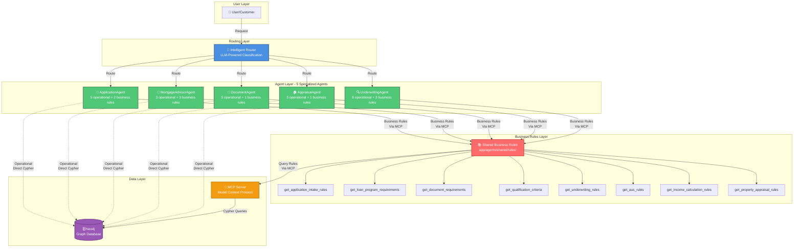

```mermaid
graph TB
    subgraph "User Layer"
        User[👤 User/Customer]
    end
    
    subgraph "Routing Layer"
        Router[🎯 Intelligent Router<br/>LLM-Powered Classification]
    end
    
    subgraph "Agent Layer - 5 Specialized Agents"
        AA[📝 ApplicationAgent<br/>5 operational + 2 business rules]
        MA[💼 MortgageAdvisorAgent<br/>3 operational + 3 business rules]
        DA[📄 DocumentAgent<br/>5 operational + 1 business rules]
        AP[🏠 AppraisalAgent<br/>5 operational + 1 business rules]
        UA[🔍 UnderwritingAgent<br/>8 operational + 3 business rules]
    end
    
    subgraph "Business Rules Layer"
        BR[📚 Shared Business Rules<br/>app/agents/shared/rules/]
        BR1[get_application_intake_rules]
        BR2[get_loan_program_requirements]
        BR3[get_document_requirements]
        BR4[get_qualification_criteria]
        BR5[get_underwriting_rules]
        BR6[get_aus_rules]
        BR7[get_income_calculation_rules]
        BR8[get_property_appraisal_rules]
        
        BR --> BR1
        BR --> BR2
        BR --> BR3
        BR --> BR4
        BR --> BR5
        BR --> BR6
        BR --> BR7
        BR --> BR8
    end
    
    subgraph "Data Layer"
        Neo4j[(🗄️ Neo4j<br/>Graph Database)]
        MCP[🔌 MCP Server<br/>Model Context Protocol]
    end
    
    User -->|Request| Router
    Router -->|Route| AA
    Router -->|Route| MA
    Router -->|Route| DA
    Router -->|Route| AP
    Router -->|Route| UA
    
    AA -.->|Operational<br/>Direct Cypher| Neo4j
    MA -.->|Operational<br/>Direct Cypher| Neo4j
    DA -.->|Operational<br/>Direct Cypher| Neo4j
    AP -.->|Operational<br/>Direct Cypher| Neo4j
    UA -.->|Operational<br/>Direct Cypher| Neo4j
    
    AA -->|Business Rules<br/>Via MCP| BR
    MA -->|Business Rules<br/>Via MCP| BR
    DA -->|Business Rules<br/>Via MCP| BR
    AP -->|Business Rules<br/>Via MCP| BR
    UA -->|Business Rules<br/>Via MCP| BR
    
    BR -->|Query Rules<br/>Via MCP| MCP
    MCP -->|Cypher Queries| Neo4j
    
    style Router fill:#4A90E2,stroke:#2E5C8A,stroke-width:2px,color:#fff
    style AA fill:#50C878,stroke:#2E7D4E,stroke-width:2px,color:#fff
    style MA fill:#50C878,stroke:#2E7D4E,stroke-width:2px,color:#fff
    style DA fill:#50C878,stroke:#2E7D4E,stroke-width:2px,color:#fff
    style AP fill:#50C878,stroke:#2E7D4E,stroke-width:2px,color:#fff
    style UA fill:#50C878,stroke:#2E7D4E,stroke-width:2px,color:#fff
    style BR fill:#FF6B6B,stroke:#C93838,stroke-width:2px,color:#fff
    style Neo4j fill:#9B59B6,stroke:#6C3483,stroke-width:2px,color:#fff
    style MCP fill:#F39C12,stroke:#B8770A,stroke-width:2px,color:#fff
```
